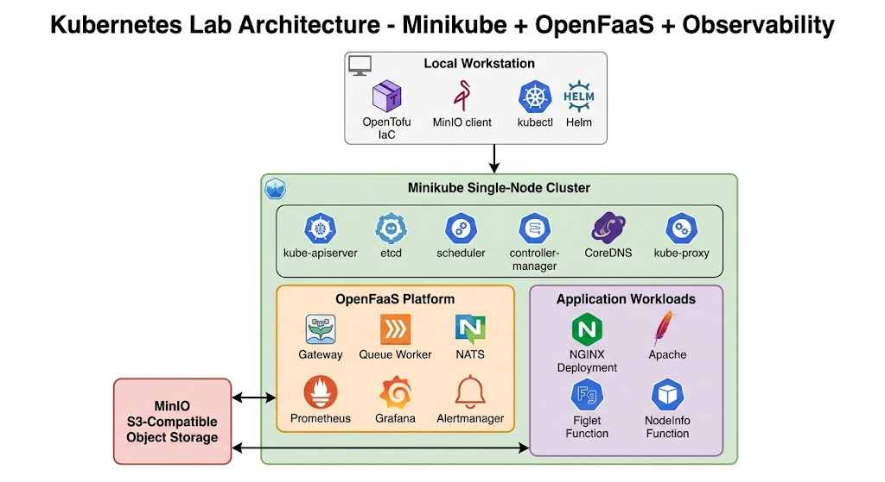

# Cloud-Native Home Lab — Minikube + OpenFaaS + Observability

   

> A production-inspired, cloud-native lab environment built on local infrastructure.
> Designed to demonstrate platform engineering skills across Kubernetes, IaC, observability, serverless, and operational lifecycle management.

---

## Architecture



The lab is organized around a **Minikube single-node Kubernetes cluster** managed from a local workstation using industry-standard tooling. All major platform engineering disciplines are represented — from cluster bootstrapping and workload deployment to observability, serverless eventing, and S3-compatible state management.

---

## Stack

| Layer                    | Technology                                                |
| ------------------------ | --------------------------------------------------------- |
| **Cluster**        | Minikube (single-node Kubernetes)                         |
| **IaC**            | OpenTofu*(reusable module infrastructure — in progress)* |
| **Serverless**     | OpenFaaS (Gateway, Queue Worker, NATS)                    |
| **Observability**  | Prometheus · Grafana · Alertmanager                     |
| **Object Storage** | MinIO (S3-compatible, used for backups and cluster state) |
| **Workloads**      | NGINX · Apache · Figlet Function · NodeInfo Function   |
| **Local Tooling**  | kubectl · Helm · MinIO Client                           |

---

## Repository Structure

```
MiniKube/
├── platform/
│   └── cluster/
│       ├── bootstrap/       # Cluster init and control plane configuration
│       ├── config/          # Cluster-level configuration files
│       └── state/           # Persisted cluster state references
├── workloads/
│   ├── core/services/       # NGINX, Apache application workloads
│   ├── observability/       # Prometheus and Grafana manifests
│   └── eventing/openfaas/   # OpenFaaS platform configuration
├── operations/
│   ├── lifecycle/           # Start, stop, and cleanup scripts
│   ├── backup/              # Backup procedures
│   ├── restore/             # Restore procedures
│   └── disaster-recovery/   # DR runbooks and scripts
├── maintenance/
│   ├── kubernetes/          # Kubernetes upgrade and patch procedures
│   └── system-updates/      # OS and tooling update scripts
├── tooling/
│   ├── local-installs/      # Local dependency installation scripts
│   └── scripts/             # General-purpose automation scripts
├── state/
│   ├── cluster-state/       # Live cluster state snapshots
│   └── snapshots/           # Point-in-time environment snapshots
├── portfolio/
│   ├── audit/               # Environment audit outputs
│   └── demos/               # Demo configurations and showcase assets
└── docs/
    ├── architecture/        # Architecture diagrams and design references
    ├── cluster-design/      # Cluster design documentation
    └── runbooks/            # Operational runbooks
```

---

## Key Capabilities Demonstrated

- **Cluster Lifecycle Management** — Full start, stop, backup, restore, and disaster recovery workflows
- **Serverless Platform** — OpenFaaS deployed and configured with NATS-backed async queue
- **Observability Stack** — Prometheus scraping, Grafana dashboards, and Alertmanager configured end-to-end
- **S3-Compatible Storage** — MinIO integrated for cluster state persistence and backup targets
- **Infrastructure as Code** — OpenTofu installed and used for provisioning workflows *(reusable module library in progress)*
- **Operational Discipline** — Structured runbooks, maintenance procedures, and lifecycle automation

---

## Roadmap

- [ ] OpenTofu reusable infrastructure modules (IaC library)
- [ ] GitOps pipeline with ArgoCD
- [ ] Multi-node cluster / HA setup
- [ ] Ingress + TLS with cert-manager
- [ ] Secrets management (Vault or Sealed Secrets)
- [ ] Service mesh (Istio or Linkerd)
- [ ] Automated backup validation

---

## Background

This lab grew out of Linux Foundation coursework and has evolved into a full-featured, actively maintained cloud-native environment. It serves as both a learning platform and a portfolio showcase targeting **Senior Cloud Engineer**, **Platform Engineer**, and **Infrastructure Engineer** roles.

All architecture decisions are intentional and documented. The structure is designed to mirror how a production platform team would organize operational concerns — separating cluster lifecycle, workload management, observability, and disaster recovery into distinct, navigable domains.

---

## Contact

Open to full-time opportunities in **Jacksonville, FL** or **Remote**.
Connect on [LinkedIn](https://www.linkedin.com) or reach out directly via GitHub.
